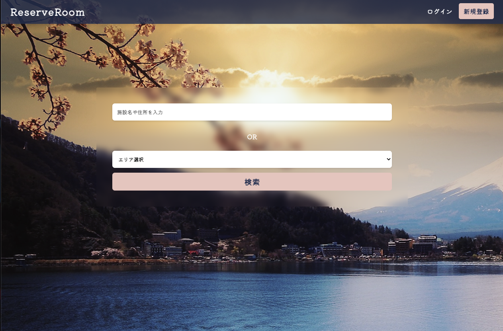
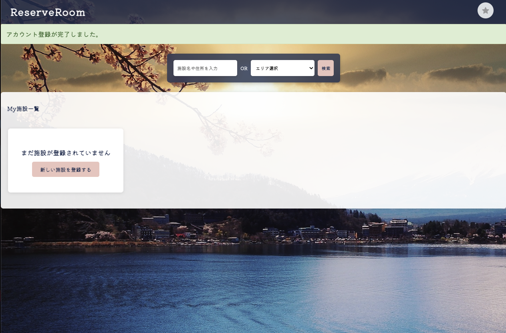
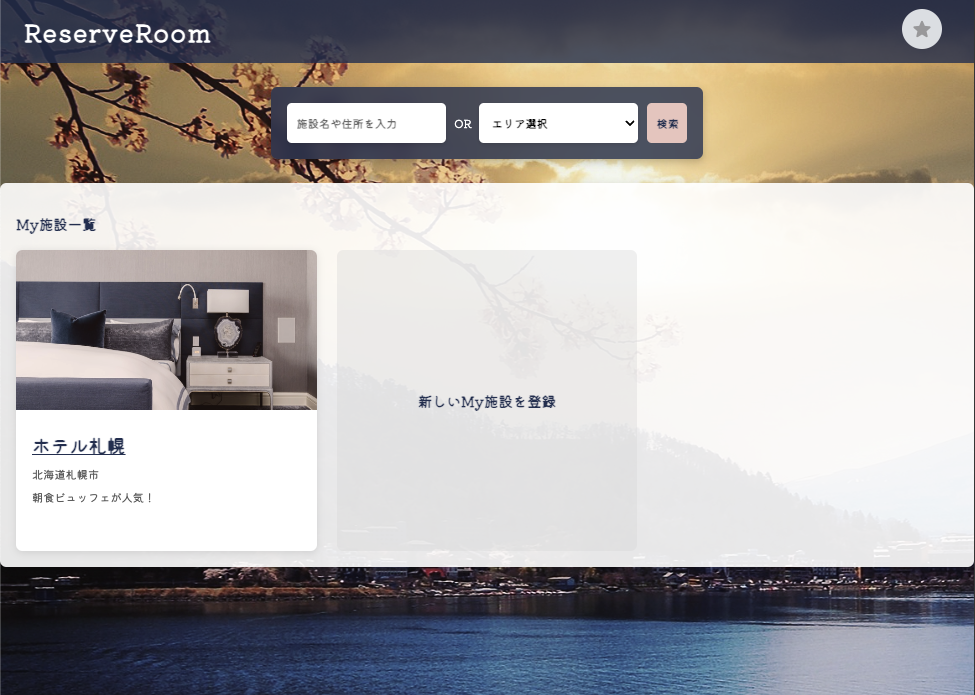
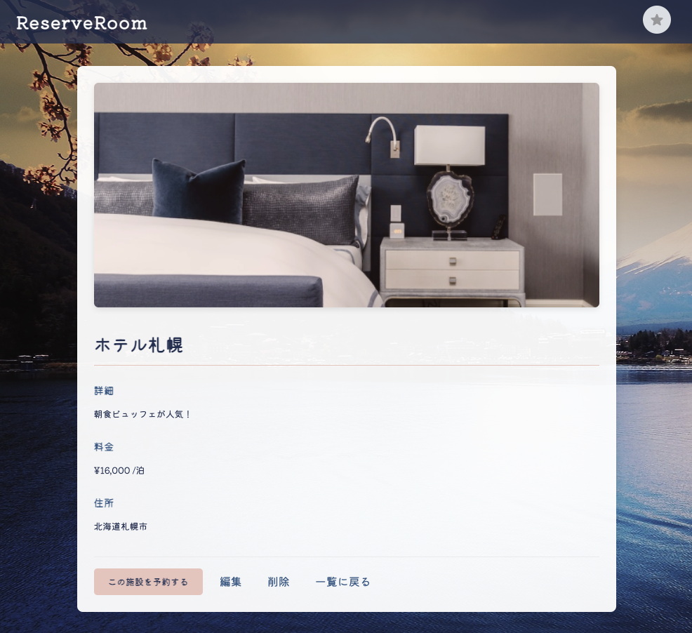
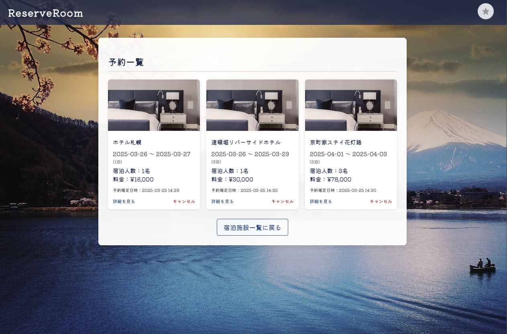
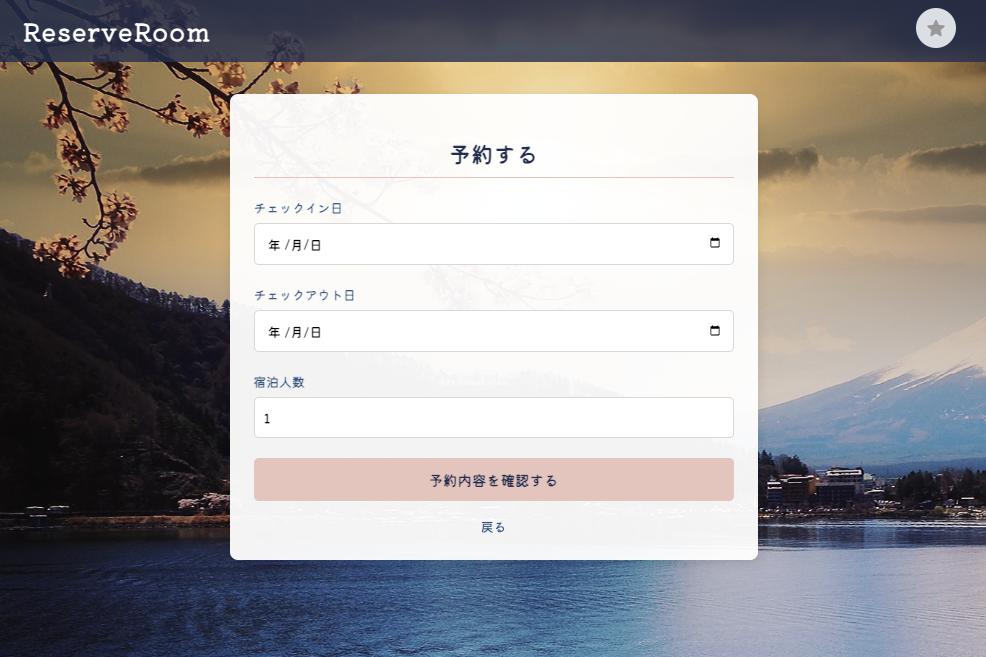
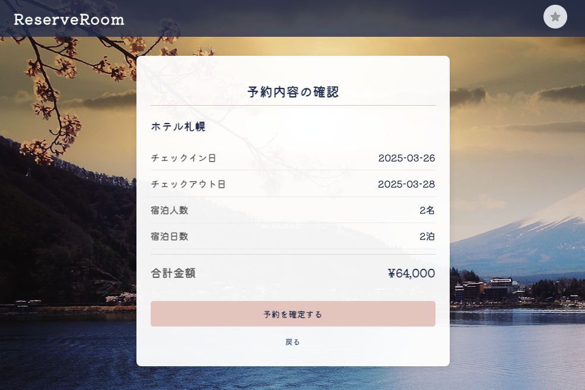
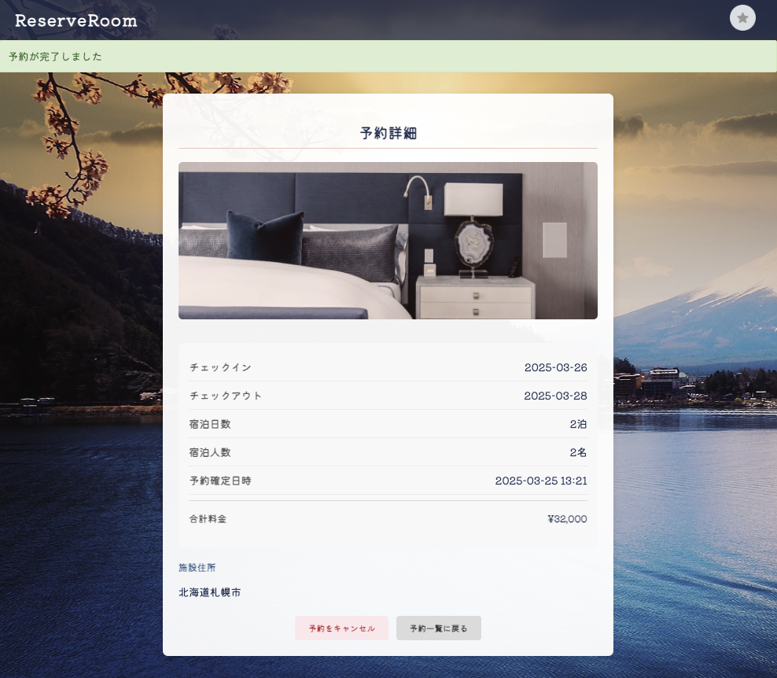

# 🏨 Booking App

## 🔍 Overview
The Booking App is a Ruby on Rails application that allows users to register accommodations and make reservations. It provides management, search, and reservation features to facilitate a smooth booking experience.

## 🚀 Features
### 📝 **Implemented Features**
- 👤 **User Authentication**
  - User login, logout, and registration using Devise
  - Profile editing (name, bio, profile image)

- 🏨 **Accommodation Management**
  - CRUD operations for accommodations (create, update, delete, list, and detail view)
  - Image upload using Active Storage
  - Only the accommodation owner can edit or delete

- 🔍 **Search Functionality**
  - Keyword search (name, address, description)
  - Area-based search (Tokyo, Osaka, Kyoto, Sapporo)


- 📅 **Reservation System**
  - Users can book accommodations (check-in, check-out, guest count)
  - View reservation list and reservation details
  - Calculate total accommodation cost (number of nights × price per night)


## 📸 Screenshots

### 🏠 Top Pages
| Description | Screenshot |
|-------------|------------|
| Landing Page |  |
| Home after Sign Up |  |
| Home after Login |  |

---

### 🏨 Accommodation & Reservation
| Description | Screenshot |
|-------------|------------|
| Accommodation Details |  |
| Reservation List |  |
| Reservation Form |  |
| Reservation Confirmation |  |
| Reservation Completed View |  |


## 🛠 Technologies Used
- 🛠 **Ruby on Rails 6.1.3.2**
- 🎨 **Bootstrap (or Tailwind CSS)**
- 💾 **SQLite** (Development Environment)
- 🔐 **Devise** (User Authentication)
- 📷 **Active Storage** (Image Upload)

## 🔧 Setup
To run this project locally, follow these steps:
```sh
git clone https://github.com/X0377/Rails-Booking-App.git
cd booking_app
bundle install
rails db:create db:migrate
rails s
```
Then, open `http://localhost:3000` in your browser.

## 🎠 License
This project is licensed under the MIT License.